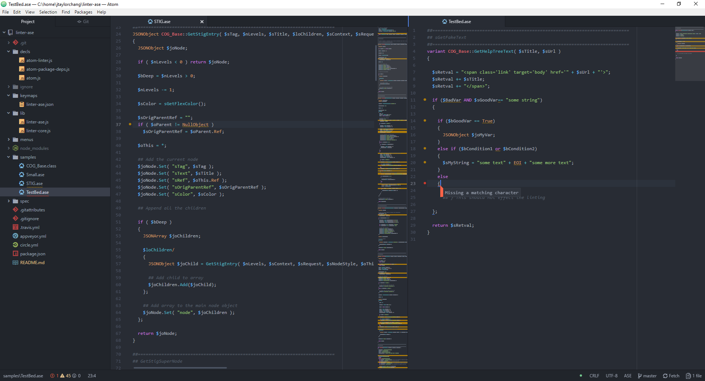

# linter-ase
`ASE` linter for Atom editor with automatic solutions, messages, and mini-map support, fully compatible with the `language-ase` grammar package and syntax highlighting.

  

## Installation
1. Open the Command Palette (Ctrl-Shift-P)
2. Type `install package` and hit enter
3. Copy the file path listed at the top (for me it is C:\\Users\\jtaylorchang\\.atom\\packages)
4. Paste into Windows Explorer
5. Copy the entire directory `linter-ase` into the `packages` folder you just navigated to
6. Reload Atom (Ctrl-Shift-F5)

## Dependencies
- `language-ase`: Allows the linter to recognize ASE specific code
- `linter`: Provides a framework to render information text

## Features
- Linting for various errors and warnings:
  - enforces correct style capitalization for a variety of constants and keywords
  - enforces Hungarian Notation naming conventions
  - enforces proper spacing as per the style convention
  - checks for missing and mismatched parenthesis, brackets, and curly braces
- Compatible with language-ASE which brings grammar recognizing and syntax highlighting to ASE files in Atom
- Recognizes pre-processor inline code in respective languages, supporting currently `XML`, `HTML`, `CSS`, and `JavaScript`
- Accepts files of `.ase` and `.class` extension
- Fully compatible with the `minimap` package to show linting in the side view

## Recommended Packages
Atom has some really fantastic Open Source packages that pair nicely.
- file-icons: adds easily recognizable icons for all commonly used file types, including ASE
- minimap: adds Sublime-Text style minimap to right hand side to quickly recognize code chunks
- minimap-linter: adds linting onto the minimap (dependency: linter, minimap)
